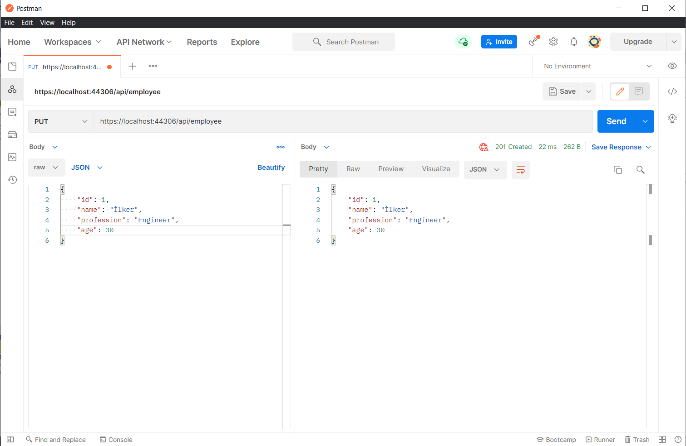

# odev1-ilker_baltaci
## Homework - 1 (API project)

- In this project, it was trying to work according to the Rest standard.

- FluentValidation.AspNetCore framework was used for applying validation processes to the model.

- Tested API's with Postman and you can check the results below.

Get request from "../api/employee" for getting all data

</img>

Get request from "../api/employee/{id}" for getting employee element by id

</img>

Get request from "../api/employee/list?name=ilker&profession=engineer" for listing elements by adding query elements 

</img>

Get request from "../api/employee/sort?name=true" by sorting with id, name, profession, age parameters

</img>

Post request from "../api/employee" with model binding by applying [FromBody] and considering validations 

</img>

Validation errors notation

</img>

Put request from "../api/employee" with model binding by applying [FromBody] and considering validations 

</img>

Deleting request from "../api/employee" 

</img>

